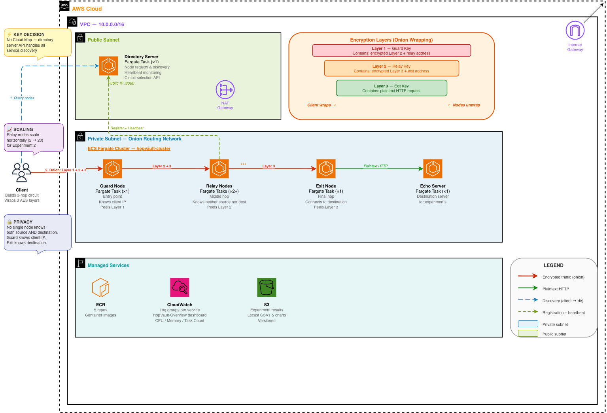

# HopVault

A distributed onion-routing network inspired by Tor, built on AWS ECS Fargate.


HopVault provides sender anonymity: no single node knows both who sent a
request and what the request is: and quantifies the latency, throughput, and
fault-tolerance cost of that anonymity through three controlled experiments.

## Why

Privacy networks are a canonical distributed-systems case study: they trade
latency for anonymity, they need circuit rebuild on failure, and they scale
horizontally via relay pools. We rebuilt a simplified Tor-like network end to
end so we could measure those tradeoffs directly:

1. **Latency cost of anonymity** — how much does each additional hop cost?
2. **Horizontal scaling** — does throughput scale linearly with relay count?
3. **Fault tolerance** — how fast does the system detect and recover when a
   relay dies mid-circuit?

## Architecture



A request traverses five services:

```
client ──► guard ──► relay ──► exit ──► destination (echo server)
       ◄─────────◄─────────◄─────────◄──
```

- **Directory server** — in-memory registry. Nodes self-register on startup
  and send heartbeats; the client calls `GET /circuit` to pick a random
  healthy guard + relay + exit triple. The only publicly reachable service
  that clients need to know about up-front.
- **Guard / relay / exit** — identical shape, each with an RSA-2048 key pair.
  During setup the client wraps a fresh AES-256 key per hop with that hop's
  RSA public key. Each hop decrypts its onion layer with AES-256-GCM, reads
  the next hop from the payload, and forwards the remainder. On the return
  path each hop re-encrypts with its session key.
- **Echo server** — controlled destination for measurements, to eliminate
  external variability.
- **Client** — Go CLI + library. Builds the 3-layer onion, sends it through
  the guard, decrypts the return-path layers. Retries on a fresh circuit if
  a hop is unreachable.

**Privacy property**: guard sees the client IP but not the destination; exit
sees the destination but not the client; relay sees neither.

Everything runs in AWS ECS Fargate behind an internet gateway. Service
discovery is the directory server's REST API (no Cloud Map — the project
targets an AWS Learner Lab account with IAM restrictions). ECR hosts the
images, CloudWatch captures logs and per-service CPU/memory metrics, and S3
archives experiment results.

## Prerequisites

| Tool | Version | Purpose |
|---|---|---|
| Go | 1.25+ | Build services and run `go test` |
| AWS CLI | v2 | `aws ecs`, `aws ec2`, `aws ecr` |
| Terraform | ≥ 1.5 | Provision AWS infrastructure |
| Docker | any recent | Build service images |
| Python | 3.11+ | Locust + chart generation (`pip install locust boto3 matplotlib pandas`) |
| GNU make | any | Experiment driver |

AWS credentials must be configured (`aws configure` or `aws sso login`) and
have permissions to create the resources in [infra/](infra/). On a Learner
Lab account this just works out of the box.

## Quick-start

From a fresh clone to a request travelling through a live 3-hop circuit:

```bash
# 1. Clone
git clone <repo-url> hopvault && cd hopvault

# 2. Provision infrastructure (~5 min)
cd infra
terraform init
terraform apply -auto-approve
export CLUSTER=$(terraform output -raw cluster_name)
export RESULTS_BUCKET=$(terraform output -raw experiment_results_bucket_name)
cd ..

# 3. Build and push the 5 service images (~4 min)
export AWS_REGION=$(aws configure get region)
export ECR=$(aws sts get-caller-identity --query Account --output text).dkr.ecr.$AWS_REGION.amazonaws.com
aws ecr get-login-password --region $AWS_REGION | docker login --username AWS --password-stdin $ECR
for svc in directory-server guard-node relay-node exit-node echo-server; do
  docker build --platform linux/arm64 -f docker/Dockerfile.$svc -t $ECR/hopvault/$svc:latest .
  docker push $ECR/hopvault/$svc:latest
done

# 4. Force ECS to pick up the :latest images
for svc in directory-server guard-node relay-node exit-node echo-server; do
  aws ecs update-service --cluster $CLUSTER --service $svc --force-new-deployment --no-cli-pager >/dev/null
done

# Wait ~2 min for tasks to become healthy, then discover public IPs:
get_ip() {
  local t=$(aws ecs list-tasks --cluster $CLUSTER --service-name $1 --query 'taskArns[0]' --output text)
  local eni=$(aws ecs describe-tasks --cluster $CLUSTER --tasks $t \
      --query 'tasks[0].attachments[0].details[?name==`networkInterfaceId`].value | [0]' --output text)
  aws ec2 describe-network-interfaces --network-interface-ids $eni \
      --query 'NetworkInterfaces[0].Association.PublicIp' --output text
}
export DIRECTORY_URL=http://$(get_ip directory-server):8080
export ECHO_SERVER_URL=http://$(get_ip echo-server):8080
echo "directory: $DIRECTORY_URL  echo: $ECHO_SERVER_URL"

# 5. Wire FORWARD_TARGET_URL into the guard so 1-hop forwarding works
cd infra
terraform apply -auto-approve -var="forward_target_url=$ECHO_SERVER_URL"
cd ..

# 6. Send a request through the full 3-hop circuit
cd client
go run . --directory-url "$DIRECTORY_URL" \
         --destination-url "$ECHO_SERVER_URL/echo?hello=world"
```

If the echo server's JSON response comes back on stdout, the full onion
flow — directory lookup, RSA key exchange, 3-layer AES wrap, forward path,
destination round-trip, 3-layer unwrap — is working.

For the full client CLI reference (all flags, POST bodies, 1-hop mode,
health-check polling, building a standalone binary, troubleshooting), see
**[USEME.md](USEME.md)**.

To tear everything down:

```bash
cd infra && terraform destroy -auto-approve
```

Force-destroy is enabled on the S3 bucket so teardown works even when
experiment results are still present.

## Running the experiments

All three experiments use the top-level [Makefile](Makefile). Export
`DIRECTORY_URL`, `ECHO_SERVER_URL`, `CLUSTER`, and `RESULTS_BUCKET` (from the
quick-start) before running any target.

### Experiment 1 — latency vs hop count (~25 min)

Measures direct-to-echo vs 1-hop-through-guard vs full-3-hop latency at
concurrency 10 / 50 / 100 / 200.

```bash
make run-direct         # baseline — direct HTTP to echo server
make run-1hop           # guard forwards to echo (no encryption)
make run-3hop           # full guard → relay → exit circuit
make charts-exp1        # renders PNGs
```

Outputs:
- `experiments/results/{direct,1hop,3hop}_stats*.csv` — Locust aggregate + timeseries
- `s3://$RESULTS_BUCKET/experiment-1/` — archived CSVs
- `docs/charts/exp1_{p50,p95,hop_latency_cost,throughput}_*.png`

Expected shape: each hop adds ~10–40 ms of p95 latency and saturates at a
lower concurrency ceiling.

### Experiment 2 — throughput vs relay count (~40 min)

Measures sustainable throughput and p95 latency at 2, 5, 10, 20 relays.
`scale-relays` issues `aws ecs update-service --desired-count N` and polls
both ECS and the directory server until all N relays are healthy.

```bash
for n in 2 5 10 20; do
  make scale-relays COUNT=$n
  make run-exp2 RELAY_COUNT=$n
done
make charts-exp2

# Optional: pull CPU metrics for the per-service chart
make export-metrics START=2026-04-10T00:00:00Z END=2026-04-10T01:00:00Z
make charts-exp2        # re-run with CPU data included
```

Outputs:
- `experiments/results/exp2_relays{2,5,10,20}_*.csv`
- `s3://$RESULTS_BUCKET/experiment-2/<relay-count>/`
- `docs/charts/exp2_{max_throughput,p95_at_ceiling,throughput_per_relay,cpu_by_service}_*.png`

### Experiment 3 — failure & recovery (~15 min)

Starts a constant 50-user 3-hop load for 5 min, kills a relay at ~60 s, and
measures detection time, rebuild duration, and request loss. Runs twice —
once with timeout-only detection and once with directory-server heartbeat
pre-detection enabled.

```bash
cd experiments/experiment3

# Run A — no pre-detection (client timeout only)
HEALTH_CHECK=false DIRECTORY_URL=$DIRECTORY_URL ECHO_SERVER_URL=$ECHO_SERVER_URL/echo \
    locust -f locustfile.py --headless --users 50 --spawn-rate 50 --run-time 300s \
    --csv results/no-predetection --host $DIRECTORY_URL &
LOCUST_PID=$!
sleep 60
python ../../scripts/kill_relay.py --cluster $CLUSTER --service relay-node \
    --output results/kill_event_no_predetection.json
wait $LOCUST_PID

# Run B — with pre-detection (5 s /nodes polling)
HEALTH_CHECK=true DIRECTORY_URL=$DIRECTORY_URL ECHO_SERVER_URL=$ECHO_SERVER_URL/echo \
    locust -f locustfile.py --headless --users 50 --spawn-rate 50 --run-time 300s \
    --csv results/with-predetection --host $DIRECTORY_URL &
LOCUST_PID=$!
sleep 60
python ../../scripts/kill_relay.py --cluster $CLUSTER --service relay-node \
    --output results/kill_event_with_predetection.json
wait $LOCUST_PID

# Charts
python generate_charts.py \
    --data-dir results \
    --kill-event-no-predetection results/kill_event_no_predetection.json \
    --kill-event-with-predetection results/kill_event_with_predetection.json \
    --out-dir ../../docs/charts
```

Outputs:
- `experiments/experiment3/results/{no,with}-predetection_*.csv`
- `experiments/experiment3/results/kill_event_*.json`
- `docs/charts/exp3_{rps_timeline,latency_scatter,detection_time,request_loss,rebuild_timeline}.png`

## Viewing results

| Where | What |
|---|---|
| [docs/charts/](docs/charts/) | All committed PNG charts |
| [experiments/results/](experiments/results/) | Raw Exp 1 + 2 Locust CSVs |
| [experiments/experiment3/results/](experiments/experiment3/results/) | Raw Exp 3 CSVs + kill-event JSON |
| `s3://$RESULTS_BUCKET/` | Versioned archive of every run |
| `HopVault-Overview` CloudWatch dashboard | Live CPU / memory / task-count / error-log widgets |
| [docs/report.md](docs/report.md) | Results writeup tying findings to BSDS concepts *(pending — Week 4 Card 7)* |

## Repository layout

```
shared/                 Go libraries used by every service
  config/               env var → NodeConfig
  server/               base HTTP server + /health endpoint
  onion/                AES-256-GCM, RSA-OAEP, KeyStore, handlers
  node/                 registration, heartbeat, identity, address resolution
directory-server/       central registry (in-memory, HTTP)
guard-node/             entry hop + 1-hop direct-exit and forward path
relay-node/             middle hop
exit-node/              terminal hop — executes destination HTTP request
echo-server/            controlled destination for experiments
client/                 CLI + library for circuit setup and onion I/O
docker/                 per-service Dockerfiles
infra/                  Terraform (VPC, ECS, ECR, IAM, S3, CloudWatch)
experiments/
  locust/               circuit_{1hop,3hop}.py, throughput_scaling.py, echo_baseline.py
  experiment3/          failure & recovery — locustfile.py + generate_charts.py
  scripts/              metric extraction, chart generation, CloudWatch export
  results/              local CSV outputs (gitignored)
scripts/                operational — kill_relay.py (failure injection)
docs/                   architecture diagram, charts, report
```

## Development

Each service is its own Go module; CI runs build + test in a matrix across
all seven. Every package clears 85 % coverage (most are 90 %+).

```bash
# Single module
cd shared && go vet ./... && go test -cover ./...

# All modules (matches .github/workflows/ci.yml):
for m in shared directory-server guard-node relay-node exit-node client echo-server; do
  (cd $m && go vet ./... && go test -cover ./...)
done
```

## Course concept mapping

- **Experiment 1 ↔** latency / availability tradeoff for privacy (Tor
  literature's anonymity-latency tension)
- **Experiment 2 ↔** horizontal scaling and Amdahl's-law-style ceiling
- **Experiment 3 ↔** fault detection, circuit-breaker pattern, MTTR

See [docs/report.md](docs/report.md) for the full writeup and numbers.
