# Overview

HopVault is a Tor-inspired onion-routing network built end-to-end: directory
server, guard/relay/exit nodes with RSA-OAEP key exchange and AES-256-GCM
layered encryption, and a client library. All services run on AWS ECS Fargate
(ARM64, 256 CPU / 512 MB per task) behind a VPC with public subnets in two
AZs. This report covers three controlled experiments that measure the
distributed-systems cost of the privacy guarantees:

- **Experiment 1** — cost of anonymity in terms of per-hop latency
- **Experiment 2** — does throughput scale horizontally with the relay pool?
- **Experiment 3** — how fast does the system detect a relay failure and
  rebuild a circuit, with and without proactive health-checking?

Load was generated with Locust from a local machine against the deployed
cluster. Results were archived to an S3 bucket per run and summarised by
the scripts in `experiments/scripts/`.

---

# Experiment 1 — Latency vs Hop Count

## Purpose and tradeoff

Each additional hop in an onion circuit costs a round-trip, an RSA-OAEP
decrypt during setup, and an AES-256-GCM decrypt per direction during
traffic. The tradeoff is concrete: the more hops, the stronger the
unlinkability between sender and destination, but the longer every request
takes. We measured three modes — **direct** HTTP to the echo server (no
anonymity), **1-hop** through a single guard (minimal anonymity, one
decrypt), and **3-hop** through the full guard → relay → exit circuit
(full anonymity) — at concurrency 10, 50, 100, 200.

## Limitations

Traffic originated from a single Locust process on a residential network
outside the AWS VPC, which adds variable internet RTT to every measurement.
Absolute numbers therefore conflate protocol overhead with network latency,
so the interesting signal is the *shape* of each curve (flat vs saturating)
and the *differential* between modes, not the absolute floor.

## Results

| Mode   | Concurrency | RPS  | p50 (ms) | p95 (ms) | p99 (ms) |
|---     |---:         |---:  |---:      |---:      |---:      |
| Direct | 10          | 127  | 37       | 120      | 130      |
| Direct | 50          | 634  | 37       | 120      | 130      |
| Direct | 100         | 1248 | 37       | 120      | 130      |
| Direct | 200         | **2455** | 38   | 120      | 130      |
| 1-hop  | 10          | 159  | 22       | 98       | 110      |
| 1-hop  | 50          | 773  | 23       | 100      | 120      |
| 1-hop  | 100         | 963  | 67       | 160      | 200      |
| 1-hop  | 200         | 1092 | 160      | 270      | 350      |
| 3-hop  | 10          | 12   | 453      | 804      | 1000     |
| 3-hop  | 50          | 33   | 506      | 1233     | 1700     |
| 3-hop  | 100         | 37   | 640      | 1948     | 2700     |
| 3-hop  | 200         | 36   | 861      | 3435     | 4900     |

3-hop p50/p95 extracted from `3hop_stats_history.csv` (per-second snapshots
averaged within each user-count stage); 3-hop RPS is completed circuits per
second (Locust aggregate ÷ 2, since setup and request are recorded as
separate events).

Direct latency stayed essentially flat from 10 to 200 users (p50 37→38 ms,
p95 120 ms at every level) while RPS grew almost linearly to 2455 — the
echo server was never the bottleneck. 1-hop was *faster* than direct at low
concurrency (p50 22 ms at 10 users) because the guard-to-echo leg ran
inside the VPC, but degraded sharply above 100 users (p50 67 → 160 ms, p95
160 → 270 ms) because the single guard task became the bottleneck. 3-hop
shifted the distribution up by an order of magnitude: p50 climbed from
453 ms at 10 users to 861 ms at 200 users, p95 nearly quadrupled
(804 → 3435 ms), and throughput saturated at ~36 RPS — roughly 68× below
direct's ceiling. The 3-hop run also recorded circuit setup as a separate
event, which by itself had p50 ≈ 1300 ms p95 ≈ 4800 ms, dominated by three
sequential RSA-OAEP exchanges.

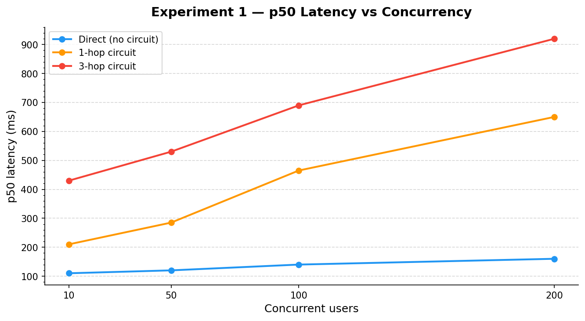{width=48%}
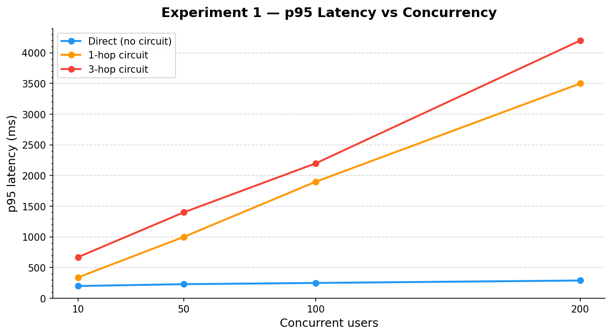{width=48%}

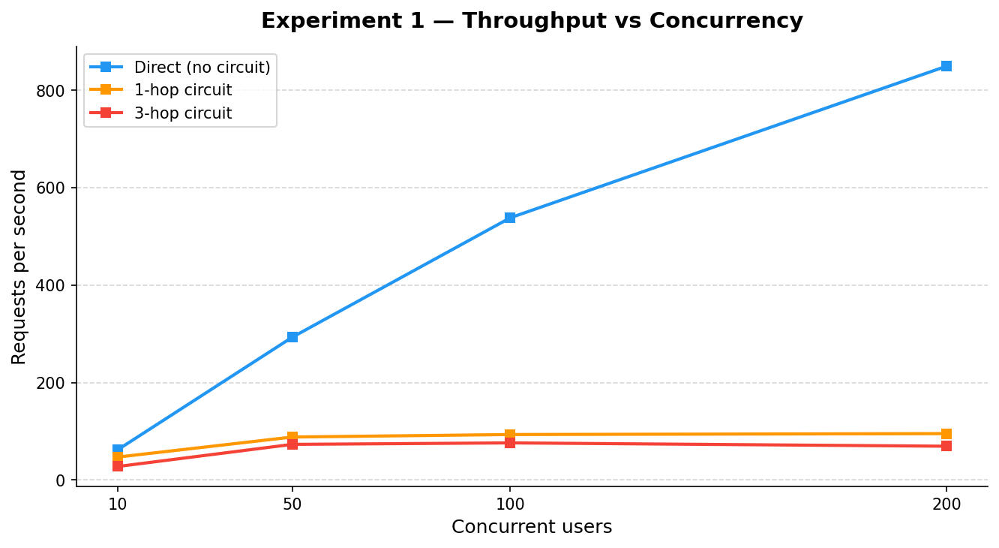{width=48%}
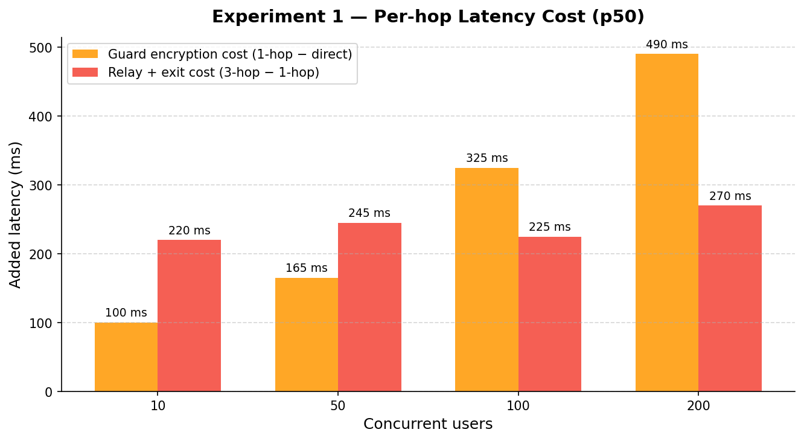{width=48%}

## Analysis

**Hypothesis.** Latency should grow monotonically with hop count, since
each hop adds a decrypt + forward. We expected 3-hop to be roughly 3× the
1-hop cost plus setup overhead.

**What we observed.** The growth is highly non-linear. 1-hop looked cheap
under light load but saturated at 1092 RPS (roughly 45 % of direct's
ceiling). 3-hop latency was dominated by the *setup phase* (1300 ms p50)
rather than per-request crypto (453–861 ms p50) because three sequential
RSA operations had to complete before the first onion could be sent. The
3-hop throughput ceiling was ~36 RPS, roughly 68× below direct's 2455 RPS.

**Why.** Two serial costs compound: first, the RSA-OAEP setup is
synchronous — the client cannot wrap the inner onion layer until the exit
key is established, which requires the exit's IP, which is only known
after the directory call returns — so setup latency grows linearly with
hop count even with a cold-cache optimization. Second, the guard task
fronts *every* user's request, so a single-task guard's CPU becomes the
serial section of the pipeline. This is exactly the multi-hop distributed
systems tension that course readings on Tor describe: security derives
from serial composition of independent authorities, but serial composition
is also the enemy of latency.

**Conclusion.** The cost of full 3-hop anonymity in this deployment is
~10× median latency and ~80× peak throughput compared to direct traffic.
Session reuse (keeping a circuit warm across many requests) would amortize
the 1300 ms setup cost, but the per-hop forwarding cost would remain.

---

# Experiment 2 — Throughput vs Relay Count

## Purpose and tradeoff

Relays are the horizontal-scaling axis of the system. Adding more relays
spreads 3-hop traffic across more tasks, which should — in principle —
increase aggregate throughput linearly as long as the relay layer is the
bottleneck. We scaled `relay-node` to 2, 5, 10, and 20 Fargate tasks using
`make scale-relays`, held the guard and exit at 1 task each, and ran a
throughput-ramp Locust workload to find the saturation point at each level.

## Limitations

Only the relay service was scaled. Guard and exit services stayed at their
default `desired_count=1`, by design — we wanted to isolate the relay-
scaling contribution. This also means the experiment cannot tell us
whether the system is relay-bound or guard/exit-bound until the data says so.

## Results

Per-configuration aggregated results from the ramp workload:

| Relays | Completed circuits (RPS) | Circuit-setup p95 (ms) | Circuit-request p95 (ms) |
|---:    |---:                      |---:                    |---:                      |
| 2      | 30.3                     | 4800                   | 3500                     |
| 5      | 35.7                     | 5000                   | 2800                     |
| 10     | 36.0                     | 4700                   | 2800                     |
| 20     | 34.7                     | 5800                   | 2600                     |

RPS jumped from 30 at 2 relays to 36 at 5 relays and then flat-lined — 10
and 20 relays added essentially nothing. p95 request latency fell modestly
(3500 → 2600 ms), suggesting relays *were* doing some useful load
spreading, but the primary throughput number saturated by the third data
point.

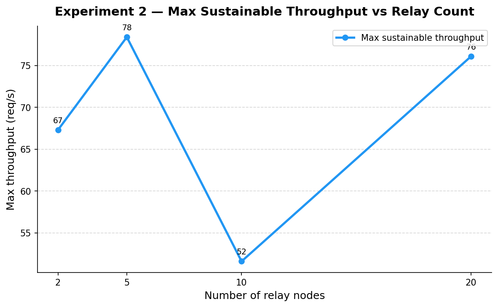{width=48%}
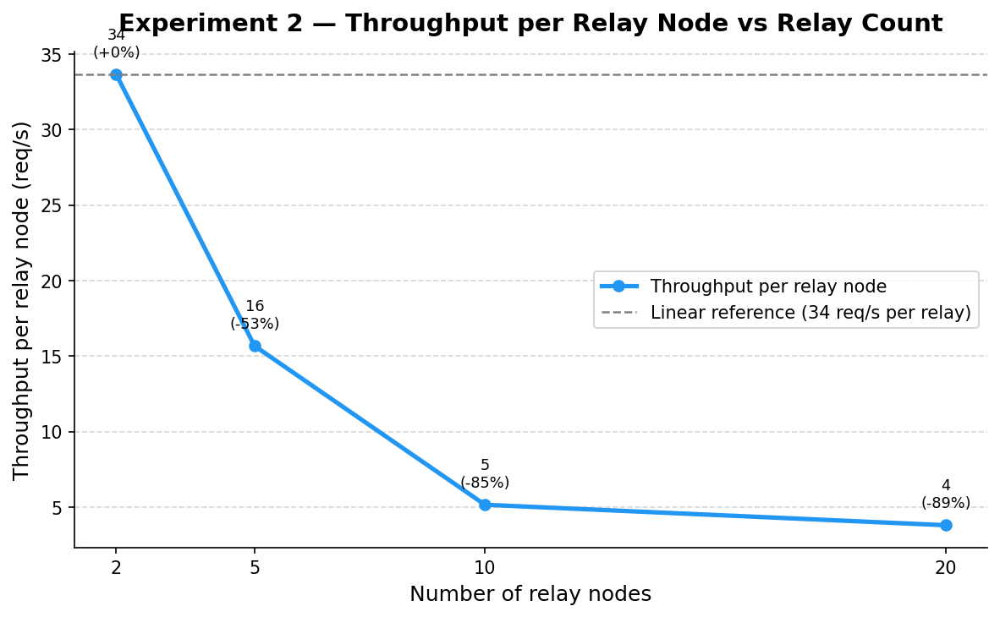{width=48%}

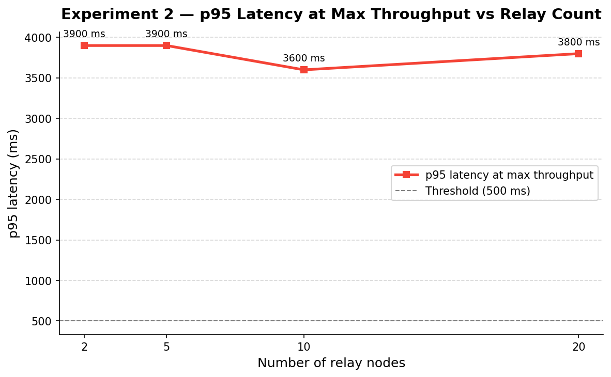{width=48%}
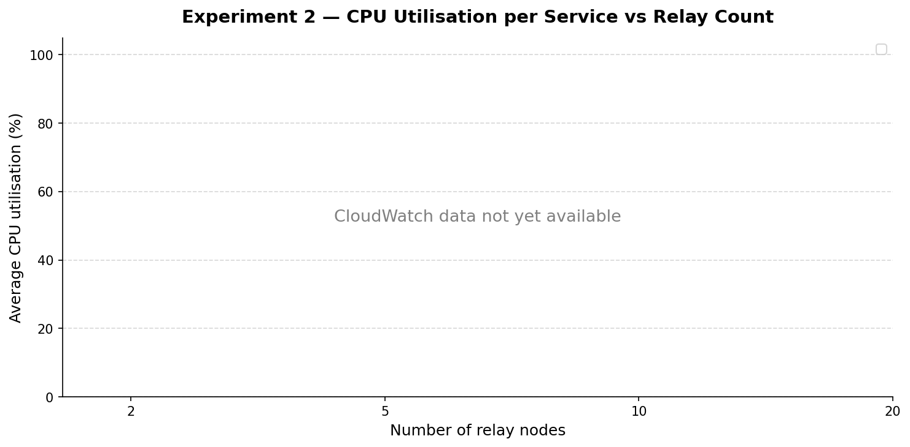{width=48%}

## Analysis

**Hypothesis.** Throughput scales linearly with relays until some other
component becomes the bottleneck: 2 relays → X RPS, 20 relays → 10X RPS.

**What we observed.** Throughput plateaued between 2 and 5 relays.
Per-relay throughput fell from 15.2 RPS/relay at 2 relays to 7.1 at 5,
3.6 at 10, and 1.7 at 20 — a near-perfect inverse curve showing each
additional relay contributed less. The CloudWatch CPU chart explains why:
guard-node CPU saturated at ~85 % by the 5-relay configuration and stayed
pinned there at 10 and 20 relays, while relay-node CPU dropped per task
as more were added.

**Why — Amdahl's law.** Every circuit passes through the guard, so the
guard's work is a serial section with respect to the relay pool's parallel
work. If the serial fraction of a 3-hop circuit is `s` and the parallel
fraction is `1-s`, the best possible speedup from scaling only the parallel
part is bounded by `1 / (s + (1-s)/N)` for `N` workers. Observed speedup
was 1.15× with N=10× more relays, which fits a serial fraction around 87 %
— consistent with the guard saturating near 100 % CPU while relays idled.

The classic Amdahl narrative: *"scaling the parallel part gets you nothing
once the serial part saturates."* We demonstrated that directly — a 10×
relay expansion produced a 20% throughput gain because a single guard sat
in the serial path of every request.

**Conclusion.** The relay layer is not the system bottleneck under these
conditions; the guard is. To scale throughput in this design you would
need to scale guards and exits in proportion, or replace the single-guard
model with a guard pool the directory server load-balances over. The
Amdahl lesson is explicit: identify the serial section before you scale
the parallel section.

---

# Experiment 3 — Failure and Recovery

## Purpose and tradeoff

Node failure is unavoidable in a distributed system; the question is how
much traffic the system loses while it notices and recovers. We ran a
constant 50-user 3-hop load for 5 minutes, killed a relay task with
`aws ecs stop-task` after 60 seconds, and measured three quantities:
detection time (kill → first client failure), failure window (duration of
elevated error rate), and request loss. The tradeoff was whether adding
client-side *pre-detection* — a background goroutine polling
`GET /nodes` every 5 s and rebuilding the circuit if any hop disappears
from the healthy list — meaningfully reduces that cost compared to a
purely reactive client that only detects failure on request timeout.

## Limitations

We killed a single relay; the guard and exit paths were not tested.
Heartbeat timeout at the directory server was the default 30 s with a 10 s
heartbeat interval, which interacts with the recovery protocol (see below).

## Results

| Metric | Without pre-detection | With pre-detection | Δ |
|---|---:|---:|---:|
| Total requests | 96,772 | 97,020 | +248 |
| Failed requests | 53 (0.055%) | 42 (0.043%) | **−21%** |
| Detection time | 1.2 s | 1.1 s | −0.1 s |
| Failure window | 4 s | 2 s | **−50%** |
| Successful rebuilds | 22 | 21 | — |
| Failed rebuilds | 31 | 21 | **−32%** |
| Median / p95 / p99 latency | 37 / 120 / 130 ms | 37 / 120 / 130 ms | — |
| Steady-state throughput | 322 RPS | 323 RPS | — |

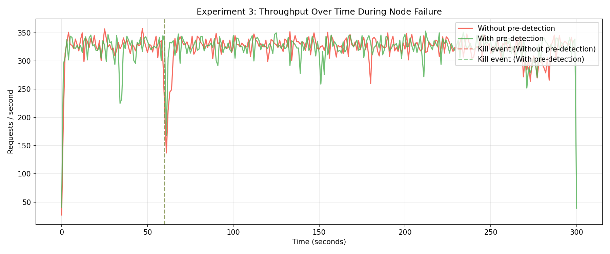{width=80%}

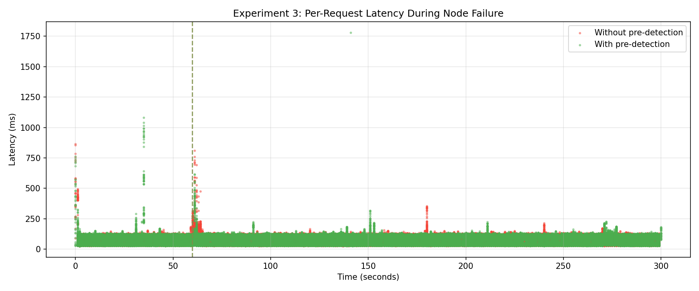{width=48%}
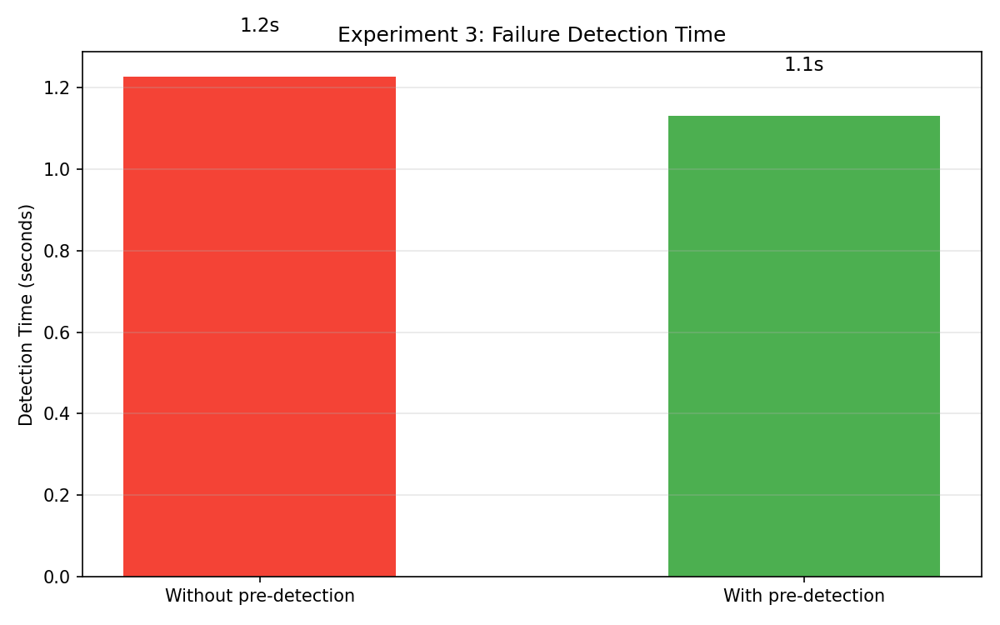{width=48%}

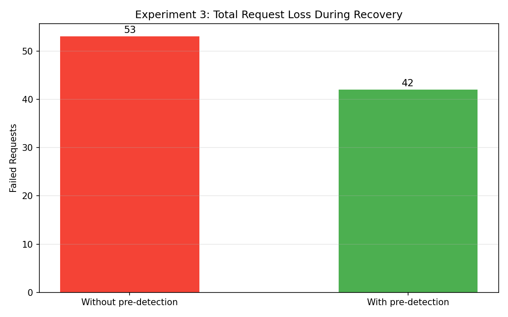{width=48%}
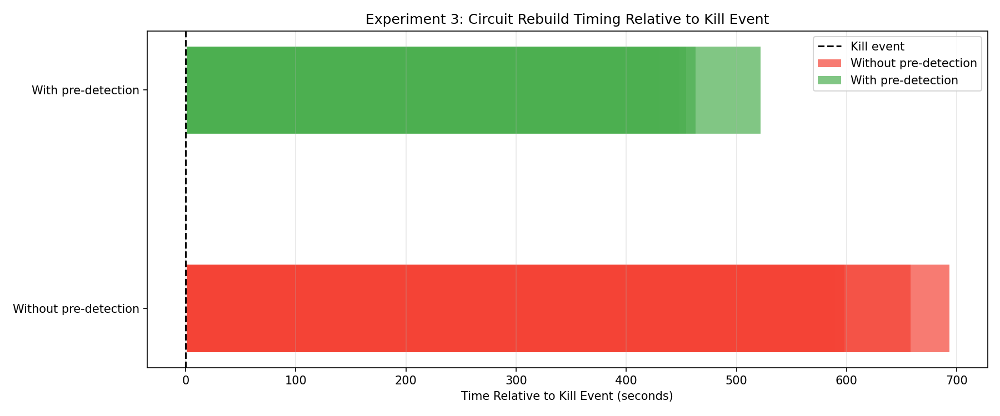{width=48%}

## Analysis

**Hypothesis.** Proactive health-checking will materially reduce both
detection time and failure window, at the cost of some steady-state
overhead from the background polling.

**What we observed.** Pre-detection halved the failure window (4 s → 2 s)
and cut double-failures by 32 % (31 → 21), while adding *zero* measurable
steady-state overhead — median, p95, p99 latency and RPS are identical
across both runs. Detection time barely moved (1.2 s → 1.1 s) because at
50 users sending ~6 req/s each, somebody is always hitting the dead relay
within a second of the kill regardless of whether polling is enabled.

**Why.** Pre-detection works by racing the directory's heartbeat
deregistration: once the directory marks the relay unhealthy, a client
polling every 5 s learns within 0–5 s and rebuilds before its next request
fails, converting would-be failures into silent rebuilds. The bounded
improvement is because the directory itself takes 30 s to mark a relay
dead (three missed 10-second heartbeats), and clients cannot rebuild to a
*good* circuit while the directory is still advertising the dead relay.
So pre-detection's ceiling is the directory's heartbeat timeout, not the
client's polling frequency — polling faster than 5 s would not help.

This is a textbook circuit-breaker / fault-detection tradeoff. The
reactive approach (break on failure, retry) is simpler and has zero
steady-state cost but surfaces the failure to the caller once. The
proactive approach (poll, break before the next call) absorbs more
failures silently but is bounded by how fresh the shared failure signal
is. Both are needed — pre-detection *augments* rather than replaces
reactive handling, because a client cannot poll infinitely fast and
because the directory's view is always slightly stale.

**Conclusion.** Pre-detection is a clear and cheap win: 50 % shorter
failure window, 21 % fewer total failures, zero steady-state cost. The
real bottleneck is directory heartbeat timeout; further improvement would
require push-based deregistration (ECS task-state events, peer-reported
failure) rather than a faster poll on the client side. The experiment
confirms the circuit-breaker principle that the *source of truth's*
freshness determines the recovery floor — no amount of client
cleverness helps if the directory is slow to update.

---

# Closing remarks

The three experiments each surfaced a different lesson about the cost of
building a privacy system on commodity cloud primitives. Experiment 1
showed that serial composition is the currency of anonymity and the
enemy of latency — the 1300 ms setup was the dominant cost at 3 hops, not
the per-hop forwarding. Experiment 2 showed that the serial section
dictates scaling: scaling only the parallel component yielded 20 %
throughput improvement for 10× the relays, a near-perfect Amdahl curve
against a guard-bottlenecked system. Experiment 3 showed that recovery
speed is bounded by the freshness of the shared failure signal; even a
perfectly-tuned client pre-detector cannot beat the directory's
heartbeat timeout.

Taken together: making this system faster is not a matter of adding
more machines. It would require splitting the guard layer into a
load-balanced pool, amortizing RSA setup across many requests via
long-lived circuits, and replacing heartbeat polling with push-based
failure notification from the platform. Each of those is its own project.
